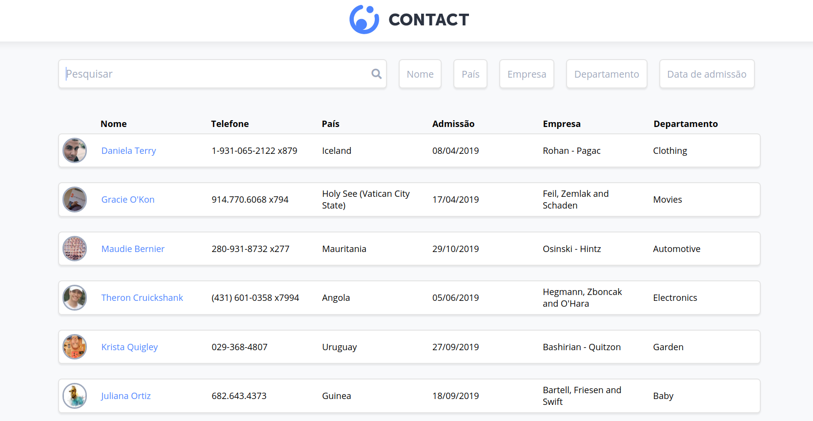

<h1 align="center">
   
  Contact List
</h1>

 Contact List - Application made with React to list, order and search for some contacts 

  

 

## Tools

   React
 

## Getting Started

1 - Clone the project with <b>git clone git@github.com:croberttdmello/list-contacts-react.git</b>

2 - Install the dependences with <b>"npm install"</b>

3 - Run the project with <b>"npm start"</b>

## License

This project is licensed under the MIT License - see the [LICENSE](https://opensource.org/licenses/MIT) page for details.
